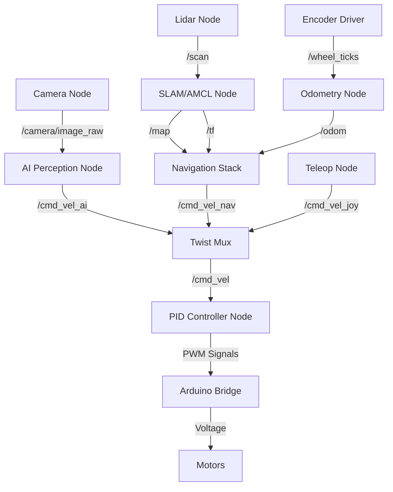

# Kiến Trúc Hệ Thống (System Architecture)

Tài liệu này mô tả chi tiết kiến trúc phần mềm và luồng dữ liệu (Data Flow) của dự án **Smart-Wheelchair**, dựa trên nền tảng **ROS 2 (Robot Operating System)** và tiêu chuẩn **AUTOSAR**.

## 1. Tổng Quan Kiến Trúc (Architecture Overview)

Hệ thống được thiết kế theo mô hình phân lớp (Layered Architecture):

1.  **Application Layer (Tầng Ứng Dụng):** Chứa các thuật toán cao cấp (Navigation, Computer Vision, SLAM).
2.  **Middleware Layer (Tầng ROS):** Đảm nhiệm việc truyền thông tin giữa các tiến trình thông qua Topics/Services.
3.  **Hardware Abstraction Layer (Tầng Phần Cứng):** Driver giao tiếp với cảm biến và bộ điều khiển motor.

---

## 2. Sơ Đồ Node ROS (ROS Node Graph)

Hệ thống bao gồm các Nodes chính sau hoạt động song song:

### Giải thích các Nodes:
*   **AI Perception Node:** Chạy mô hình CNN/YOLO để nhận diện vật thể từ Camera. Xuất ra lệnh điều khiển nếu ở chế độ "Follow-me".
*   **Navigation Stack (Nav2):** Nhận bản đồ và vị trí xe, tính toán quỹ đạo (Global/Local Planner) để đi đến đích.
*   **Twist Mux:** Bộ điều phối ưu tiên. Lệnh từ tay cầm (Teleop) > Lệnh tự hành (Nav) > Lệnh AI.
*   **PID Controller Node:** Chuyển đổi vận tốc mong muốn (m/s) thành tốc độ quay bánh xe (RPM) và gửi xuống Arduino.

---

## 3. Danh Sách Topic Chính (Key Topics Core)

| Topic Name | Message Type | Mô Tả |
| :--- | :--- | :--- |
| `/cmd_vel` | `geometry_msgs/Twist` | Lệnh vận tốc (linear & angular) gửi xuống bộ điều khiển. |
| `/odom` | `nav_msgs/Odometry` | Vị trí ước lượng của xe dựa trên Encoder. |
| `/scan` | `sensor_msgs/LaserScan` | Dữ liệu quét từ Lidar 360 độ. |
| `/tf` | `tf2_msgs/TFMessage` | Cây biến đổi tọa độ (map -> odom -> base_link). |
| `/map` | `nav_msgs/OccupancyGrid` | Bản đồ tĩnh của môi trường (Static Map). |
| `/camera/image_raw`| `sensor_msgs/Image` | Luồng hình ảnh thô từ Camera. |

---

## 4. Giao Tiếp Phần Cứng (Hardware Interface)

### Raspberry Pi <-> Arduino (Serial Communication)
*   **Giao thức:** UART (Serial USB).
*   **Baudrate:** 115200 hoặc 57600.
*   **Định dạng gói tin (Packet Format):**
    *   *Gửi đi (Pi -> Arduino):* `V,<left_pwm>,<right_pwm>\n`
    *   *Nhận về (Arduino -> Pi):* `E,<left_ticks>,<right_ticks>,<sonar_dist>\n`

Việc tách biệt này đảm bảo các tác vụ thời gian thực (như đếm xung Encoder và PID vòng lặp nhanh) được xử lý bởi Arduino, trong khi Raspberry Pi tập trung xử lý ảnh và thuật toán nặng.
