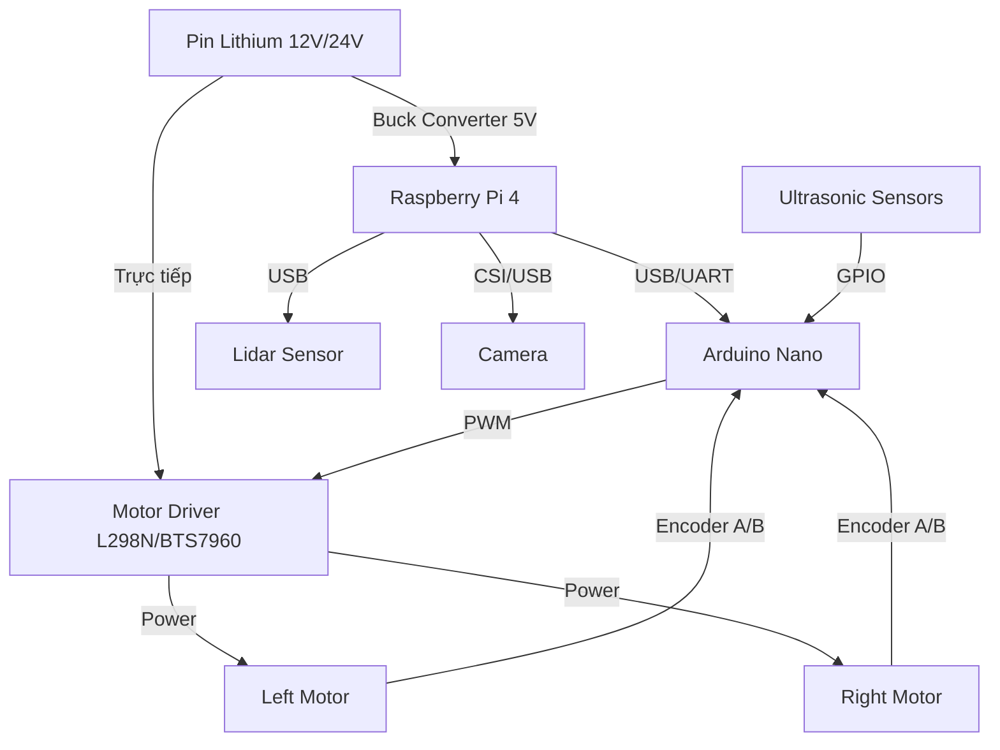

# Thiết Kế Phần Cứng (Hardware Design)

Tài liệu này mô tả chi tiết về hệ thống điện, sơ đồ đấu nối và danh sách linh kiện của **Smart-Wheelchair**.

## 1. Sơ Đồ Khối Phần Cứng (Hardware Block Diagram)

Hệ thống sử dụng kiến trúc **ECU Kép (Dual-ECU)** để đảm bảo an toàn và hiệu năng:

*   **High-Level ECU (Raspberry Pi 4):** "Bộ não" xử lý Logic, AI, ROS.
*   **Low-Level ECU (Arduino Nano):** "Cơ bắp" điều khiển Motor và đọc cảm biến cơ bản.

---

## 2. Danh Sách Linh Kiện (Bill of Materials - BOM)

| STT | Tên Linh Kiện | Thông Số Kỹ Thuật (Đề xuất) | Số Lượng | Vai Trò |
| :-- | :--- | :--- | :-- | :--- |
| 1 | **Raspberry Pi 4** | 4GB/8GB RAM, MicroSD 64GB Class 10 | 1 | Xử lý trung tâm, chạy ROS. |
| 2 | **Arduino Nano** | ATmega328P, 16MHz | 1 | Điều khiển PID, đọc Encoder. |
| 3 | **Động Cơ DC (Giảm tốc)** | 12V/24V, Torque > 10kg.cm, có Encoder | 2 | Truyền động bánh xe chính. |
| 4 | **Motor Driver** | BTS7960 (43A) hoặc L298N (2A - chỉ cho test) | 1-2 | Khuếch đại dòng điện cho động cơ. |
| 5 | **Lidar** | RPLidar A1/A2 hoặc YDLidar X4 | 1 | Quét bản đồ 2D. |
| 6 | **Camera** | Pi Camera v2 hoặc Webcam Logitech C270 | 1 | Thu nhận hình ảnh cho AI. |
| 7 | **Nguồn Pin** | Ắc quy 12V hoặc Pin Li-Po 3S/4S 11.1V/14.8V | 1 | Cấp nguồn toàn hệ thống. |
| 8 | **Mạch hạ áp (Buck)** | LM2596 (12V xuống 5V 3A) | 1 | Cấp nguồn ổn định cho Pi/Arduino. |

---

## 3. Sơ Đồ Đấu Nối Pin (Pinout Mapping)

### Kết Nối Arduino (Ví dụ tham khảo)

| Chân Arduino | Thiết Bị | Chức Năng |
| :--- | :--- | :--- |
| **D5** | Motor Driver (Left) | PWM (Tốc độ) |
| **D6** | Motor Driver (Left) | DIR (Hướng) |
| **D9** | Motor Driver (Right)| PWM (Tốc độ) |
| **D10** | Motor Driver (Right)| DIR (Hướng) |
| **D2 (INT0)** | Encoder Left | Phase A (Ngắt) |
| **D4** | Encoder Left | Phase B |
| **D3 (INT1)** | Encoder Right | Phase A (Ngắt) |
| **D7** | Encoder Right | Phase B |
| **A4 (SDA)** | Màn hình LCD / I2C | (Tùy chọn) |
| **A5 (SCL)** | Màn hình LCD / I2C | (Tùy chọn) |

*Lưu ý: Sơ đồ chân có thể thay đổi tùy thuộc vào driver động cơ cụ thể mà bạn sử dụng.*

---

## 4. Thiết Kế Cơ Khí (Mechanical Design)
*   **Khung xe:** Sử dụng khung xe lăn tiêu chuẩn hoặc khung nhôm định hình.
*   **Bánh xe:** Cấu trúc **Differential Drive** (2 bánh dẫn động + 2 bánh tự lựa/caster).
*   **Vị trí Lidar:** Đặt ở vị trí thoáng, không bị che khuất (thường là phía trước mũi xe hoặc trên cao ở tay cầm sau).
*   **Vị trí Camera:** Gắn phía trước, góc nhìn bao quát đường đi.

---

## 5. Lưu Ý An Toàn Điện
1.  **Chung Ground (GND):** Bắt buộc phải nối chung dây Mass (GND) của Pin, Arduino, Driver và Raspberry Pi để tín hiệu giao tiếp ổn định.
2.  **Cầu chì:** Nên lắp cầu chì bảo vệ ngay sau cực dương của Pin.
3.  **Công tắc khẩn cấp (E-Stop):** Một nút nhấn ngắt nguồn động cơ trực tiếp (cắt nguồn Driver) phải được bố trí ở vị trí dễ với tới.
